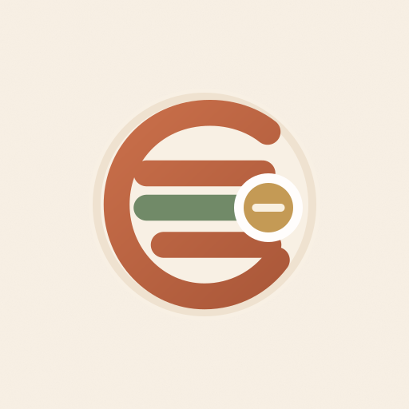

# Eganyé 🌍 — La Tontine Digitale pour l'Afrique



**Eganyé** est une plateforme financière communautaire moderne (PWA) conçue spécifiquement pour le marché africain (notamment le Togo et l'Afrique de l'Ouest). Elle permet de digitaliser et de sécuriser la pratique traditionnelle de la **tontine** (cercles d'épargne rotative). 

L'application cible particulièrement les mamans commerçantes et la jeunesse, offrant une interface intuitive, des transactions sécurisées et une transparence totale.

---

## ✨ Fonctionnalités Principales

- **🔄 Cercles de Tontines Personnalisés**
  - Création de cercles (journaliers, hebdomadaires, mensuels)
  - Ordre de gain (tirage au sort, ou ordre fixe)
  - Suivi en temps réel de l'état de la caisse

- **💳 Intégration Mobile Money**
  - Simulation de paiements via les agrégateurs locaux (Tmoney, Moov, Wave, etc.)
  - Versement en espèces avec validation par le trésorier

- **🛡️ Score de Fiabilité**
  - Un "Reputation Score" basé sur la ponctualité des versements et l'historique
  - Les retards impactent le score, récompensant ainsi les bons payeurs

- **📱 Expérience Utilisateur (UX) Premium**
  - Mode Clair / Sombre
  - Design "Glassmorphism" subtil et moderne
  - Micro-animations via `motion`
  - Composants accessibles via `shadcn/ui`

- **💬 Communication Intégrée**
  - Chat en direct par cercle
  - Notifications intelligentes
  - Multilingue (Français, Anglais, Wolof, Bambara)

- **🤖 Assistant IA**
  - Copilote intégré pour aider les utilisateurs à naviguer et répondre à leurs questions financières.

---

## 🛠️ Stack Technique

- **Frontend** : [React 19](https://react.dev/) + [Vite](https://vitejs.dev/)
- **Styling** : [Tailwind CSS v4](https://tailwindcss.com/) + [shadcn/ui](https://ui.shadcn.com/)
- **Animations** : [Motion](https://motion.dev/)
- **Backend & Auth** : [Supabase](https://supabase.com/) (Auth, Database, Realtime, Storage)
- **Charts** : [Recharts](https://recharts.org/)
- **Icons** : [Lucide React](https://lucide.dev/)

---

## 🚀 Installation & Développement Local

1. **Cloner le projet**
   ```bash
   git clone https://github.com/Codorah/egany-.git
   cd egany-
   ```

2. **Installer les dépendances**
   ```bash
   npm install
   ```

3. **Configuration de l'environnement**
   Créez un fichier `.env` à la racine du projet et ajoutez vos clés Supabase :
   ```env
   VITE_SUPABASE_URL=votre_supabase_url
   VITE_SUPABASE_ANON_KEY=votre_supabase_anon_key
   ```

4. **Lancer le serveur de développement**
   ```bash
   npm run dev
   ```
   L'application sera accessible sur `http://localhost:5173`.

---

## 📂 Architecture du Projet

```
egany-/
├── public/                 # Assets statiques (images, pwa icons)
├── src/
│   ├── components/         # Composants React (UI & Views)
│   │   └── ui/             # Composants shadcn réutilisables
│   ├── contexts/           # Contextes React (Theme, Langue)
│   ├── hooks/              # Custom Hooks React
│   ├── lib/                # Fonctions utilitaires (Supabase, API, Ledger)
│   ├── types/              # Interfaces et Types TypeScript
│   ├── App.tsx             # Composant racine et routing state
│   └── index.css           # Design System Global & Variables CSS
├── supabase/               # Schémas SQL et migrations
└── package.json            # Dépendances et scripts
```

---

## 🔒 Sécurité et Base de données (Supabase)

Eganyé utilise Supabase pour :
- **Authentification** : Email/Mot de passe et Google OAuth.
- **RLS (Row Level Security)** : Les politiques garantissent que chaque utilisateur ne peut voir et modifier que les données de ses propres cercles.
- **Triggers** : Automatisation de la création de profils à l'inscription et d'autres flux de données.

---

## 🤝 Contribution

1. Forkez le projet.
2. Créez votre branche de fonctionnalité (`git checkout -b feature/AmazingFeature`).
3. Commitez vos changements (`git commit -m 'Add some AmazingFeature'`).
4. Pushez vers la branche (`git push origin feature/AmazingFeature`).
5. Ouvrez une Pull Request.

---

## 📜 Licence

© 2026 Eganyé. Tous droits réservés.
